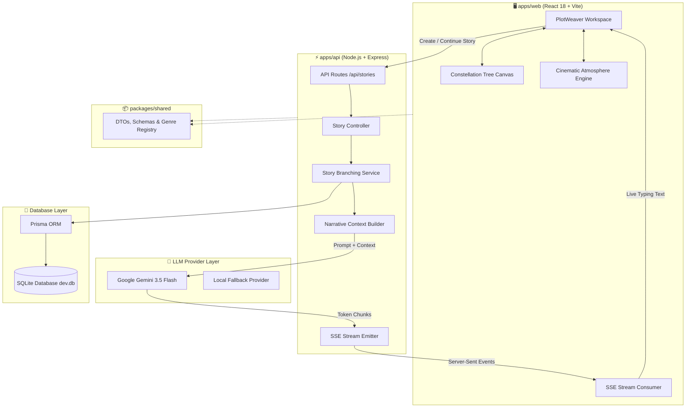

<div align="center">

# ✨ PlotWeaver Studio
### **AI Short Story Co-Writer with Multiverse Plot Branching & Dynamic Atmospheres**

[](https://www.typescriptlang.org/)
[](https://react.dev/)
[](https://vitejs.dev/)
[](https://expressjs.com/)
[](https://www.prisma.io/)
[](https://www.sqlite.org/)
[](https://deepmind.google/technologies/gemini/)
[](https://pnpm.io/)

<br/>

**PlotWeaver Studio** is a next-generation, cinematic story co-writing environment. Writers collaborate with **Google Gemini 3.5 Flash** in real-time, branching narratives into parallel alternate realities, navigating multi-timeline graph trees, and immersing themselves in 10 dynamic animated genre atmospheres.

[Key Features](#-key-features) • [System Architecture](#-system-architecture) • [Genre Atmospheres](#-10-dynamic-genre-atmospheres) • [Installation Guide](#-installation--setup-guide) • [Keyboard Shortcuts](#-interactive-controls)

---

</div>

## 🌟 Key Features

<table>
  <tr>
    <td width="50%">
      <h3>🌌 Multiverse Constellation Graph</h3>
      <p>Interactive tree canvas that visualizes every chapter, decision node, and alternate branch. Pan, zoom, inspect historical divergence points, and rewind time to branch reality in new directions.</p>
    </td>
    <td width="50%">
      <h3>⚡ Real-Time Gemini AI Co-Writing</h3>
      <p>Powered by <b>Google Gemini 3.5 Flash</b> with live Server-Sent Events (SSE) token streaming. Generates continuous literary prose tailored to genre guidelines, user premises, and tone constraints.</p>
    </td>
  </tr>
  <tr>
    <td width="50%">
      <h3>🔀 Tripartite Archetype Decision Dock</h3>
      <p>Every story chapter presents 3 distinct branching vectors: <b>Confrontation</b> (high-stakes action), <b>Investigation</b> (analytical clue gathering), and <b>Divergence</b> (unconventional twists).</p>
    </td>
    <td width="50%">
      <h3>🎭 10 Living Genre Atmospheres</h3>
      <p>Pure CSS and canvas animated living worlds behind the workspace: from wooden ships rocking in ocean storms and ancient Egyptian pyramids to deep space nebulae and nocturnal express trains.</p>
    </td>
  </tr>
  <tr>
    <td width="50%">
      <h3>🏛️ Multiverse Vault & Snapshot Forking</h3>
      <p>Freeze entire story states as immutable snapshots. Store your timelines, browse the vault with genre filters, and fork any past snapshot into a brand new story tree.</p>
    </td>
    <td width="50%">
      <h3>📑 Studio Screenplay Export Suite</h3>
      <p>One-click compiled export of your active timeline into formatted <b>Markdown</b> or print-ready <b>PDF</b> with metadata headers, timestamps, and path lineage.</p>
    </td>
  </tr>
</table>

---

## 🏗️ System Architecture

PlotWeaver is architected as an ultra-responsive, modular **pnpm monorepo** with end-to-end TypeScript strict typing and zero-latency SSE streaming:



---

## 🎨 10 Dynamic Genre Atmospheres

When switching themes in the workspace, PlotWeaver dynamically updates background animations, CSS variable tokens, glow colors, shadows, and fonts with **zero page reloads**:

| Genre | Icon | Atmosphere Visual Effects | Dominant Palette |
| :--- | :---: | :--- | :--- |
| **Adventure** | 🧭 | Rocking wooden galleon, ocean waves, directional wind gusts, lightning bolts & falling rain | Sunburst Orange (`#f97316`) & Ocean Teal |
| **Egyptian / Historical** | 🏛️ | Ancient pyramids, blazing desert sun, temple pillars, golden pharaoh & blowing sandstorms | Amber Gold (`#d97706`) & Terracotta |
| **Science Fiction** | 🚀 | Rotating conic nebula, cyber 3D perspective synth grid, core singularity & starships | Cyan (`#00e5ff`) & Electric Violet |
| **Romance / Love** | 🌹 | Deep rose nebula, celestial orbit rings, converging lover orbs & expanding 3D heart | Neon Rose (`#f43f5e`) & Magenta |
| **Detective / Noir** | 🔍 | Rainy city skyline, flickering skyscraper windows, streetlamp cones & red/blue police sirens | Amber Gold (`#f59e0b`) & Crimson |
| **Modern Thriller** | ⚡ | Looping night express train, mountain pines, flickering railway signal lamps & cold rain | Electric Gold (`#eab308`) & Emerald |
| **Theater / Drama** | 🎭 | Velvet red proscenium curtains, golden arch, perspective wooden floor & swaying spotlight | Crimson Velvet (`#e11d48`) & Gold |
| **Cosmic Horror** | 👁️ | Blackwood forest silhouettes, blood moon halo, flying witch, flapping bats & lightning | Blood Red (`#ef4444`) & Abyss Black |
| **Satire / Comedy** | 🎭 | Slapstick cartoon city, moving delivery van, blinking windows, starbursts & falling confetti | Cyan (`#06b6d4`) & Yellow |
| **High Fantasy** | ⚔️ | Arcane auroras, glowing celestial runes, ancient monoliths & floating fairy dust | Arcane Gold (`#eab308`) & Jade |

---

## 🚀 Installation & Setup Guide

### Prerequisites

Ensure you have the following installed on your machine:
- **Node.js**: `v18.0.0` or newer (`node --version`)
- **pnpm**: `v9.0.0` or newer (`pnpm --version`)

> [!TIP]
> If pnpm is not installed, enable it instantly via Corepack:
> ```powershell
> corepack enable
> corepack prepare pnpm@9.15.9 --activate
> ```

---

### Step 1: Clone the Repository

```powershell
git clone https://github.com/DAMERLA-ANAND/AI-Short-Story-Co-writer-with-Plot-Branching.git
Set-Location AI-Short-Story-Co-writer-with-Plot-Branching
```

---

### Step 2: Install Monorepo Dependencies

Install all dependencies across `@plotweaver/web`, `@plotweaver/api`, and `@plotweaver/shared`:

```powershell
pnpm install
```

Build the shared contract library:

```powershell
pnpm --filter @plotweaver/shared build
```

---

### Step 3: Configure Environment Variables

1. Copy the example `.env` file for the API:

```powershell
Copy-Item apps/api/.env.example apps/api/.env
```

2. Open `apps/api/.env` and configure your settings:

```env
# Server Port
PORT=3001

# Prisma SQLite Database URL
DATABASE_URL="file:./dev.db"

# Allowed Frontend URL (CORS)
CORS_ORIGIN="http://localhost:5173"

# LLM Provider: 'gemini', 'universal', or 'mock'
LLM_PROVIDER=gemini

# Google Gemini API Key (Get from https://aistudio.google.com/)
GEMINI_API_KEY=your_actual_gemini_api_key_here
```

| Variable | Description | Recommended / Default |
| :--- | :--- | :--- |
| `PORT` | Backend Express server port | `3001` |
| `DATABASE_URL` | SQLite database file path | `file:./dev.db` |
| `CORS_ORIGIN` | Web client origin URL | `http://localhost:5173` |
| `LLM_PROVIDER` | Story generation engine (`gemini`, `universal`, or `mock`) | `gemini` |
| `GEMINI_API_KEY` | Google Gemini API Key | Required for live AI streaming |

---

### Step 4: Initialize the SQLite Database

Generate the Prisma Client and sync the schema to your local SQLite database:

```powershell
pnpm db:generate
pnpm db:push
```

*(Optional) Seed the database with sample branching stories and snapshots:*
```powershell
pnpm seed:benchmark
```

---

### Step 5: Launch the Development Servers

Start both the Backend API and Frontend Web client in concurrent terminals:

#### Terminal 1 — Backend API (Port 3001)
```powershell
pnpm dev:api
```
*Health check:* [http://localhost:3001/api/health](http://localhost:3001/api/health)

#### Terminal 2 — Frontend Studio (Port 5173)
```powershell
pnpm dev:web
```
*Web App:* [http://localhost:5173](http://localhost:5173)

---

## ⌨️ Interactive Controls

| Shortcut / Action | Function | Location |
| :--- | :--- | :--- |
| **`1`**, **`2`**, **`3`** | Choose Branching Vector (Confrontation / Investigation / Divergence) | Story Workspace |
| **`ESC`** | Toggle Zen Mode (immersive reading with minimal UI) | Story Workspace |
| **Click & Drag** | Pan around the Multiverse Graph canvas | Visual Graph Canvas |
| **Scroll Wheel** | Zoom In / Out of narrative tree nodes | Visual Graph Canvas |
| **Click Node** | Time-travel rewind to inspect past decisions or branch anew | Visual Graph Canvas |
| **Theme Dropdown** | Switch between 10 living genre atmospheres live | Top Navigation Bar |

---

## 🧪 Verification & Testing

Run the full automated test suite covering database operations, AI branching flows, and API routes:

```powershell
pnpm test:all
```

To build all packages for production:

```powershell
pnpm build
```

---

## 📁 Monorepo Layout

```
AI-Short-Story-Co-writer-with-Plot-Branching/
├── apps/
│   ├── web/                        # React 18 + Vite Frontend
│   │   ├── src/
│   │   │   ├── api/                # REST & SSE Client wrappers
│   │   │   ├── components/
│   │   │   │   ├── atmosphere/     # 10 Animated Living Scene Components
│   │   │   │   ├── tree/           # Interactive Constellation Graph
│   │   │   │   └── workspace/      # Reader, Choice Dock, Headers & Modals
│   │   │   ├── pages/              # Workspace, New Story, Library & Viewer
│   │   │   └── styles/             # Centralized design tokens & genres.css
│   │   └── package.json
│   └── api/                        # Express + Prisma Backend
│       ├── prisma/                 # Schema & SQLite database
│       ├── src/
│       │   ├── controllers/        # Story & Snapshot controllers
│       │   ├── routes/             # REST & SSE endpoints
│       │   ├── services/           # Gemini LLM, branching & context logic
│       │   └── providers/          # Gemini 3.5 & Mock AI providers
│       └── package.json
├── packages/
│   └── shared/                     # Shared TypeScript contracts, DTOs & tokens
│       ├── src/                    # Genre registry, archetypes, validations
│       └── package.json
├── attachments/                    # Visual reference animation assets
├── package.json                    # Monorepo workspaces & scripts
└── README.md                       # Documentation & setup guide
```

---

<div align="center">

**Crafted with passion for storytellers, worldbuilders, and creative AI enthusiasts.**

*Star this repository if PlotWeaver inspired your storytelling!*

</div>
